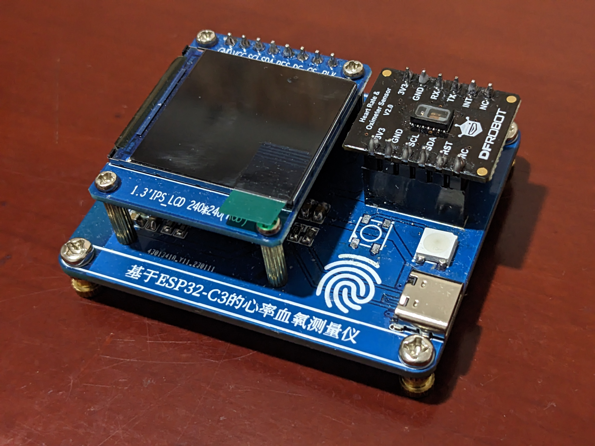
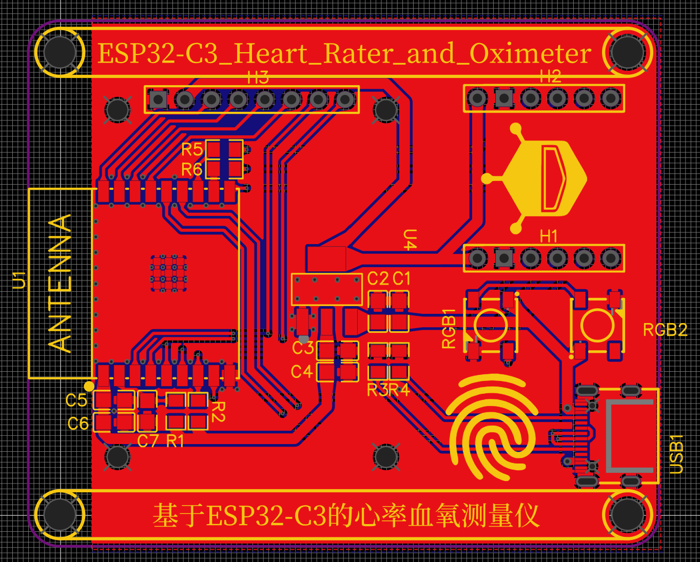

# ESP32-C3_Heart_Rater_and_Oximeter

- [ESP32-C3_Heart_Rater_and_Oximeter介绍](#ESP32-C3_Heart_Rater_and_Oximeter介绍)
- [硬件设计](#硬件设计)
- [用户操作](#用户操作)
- [有待优化](#有待优化)

## ESP32-C3_Heart_Rater_and_Oximeter介绍

	

ESP32-C3_Heart_Rater_and_Oximeter是基于[ESP32­-C3­-WROOM­-02模组](https://www.espressif.com/zh-hans/products/socs/esp32-c3)和[DFRobot MAX30102 心率血氧传感器模块](https://wiki.dfrobot.com.cn/_SKU_SEN0344_Fermion_MAX30102_Heart_Rate_and_Oximeter_Sensor_V2)开发的心率血氧测量仪，配合一块[1.3寸的LCD显示屏](https://item.taobao.com/item.htm?&id=565812505490)，可实现对人体心率和血氧饱和度的实时测量，数据处理，最后通过屏幕显示出人体心率和血氧饱和度的实时数值的功能。

## 硬件设计

	

[原理图](hardware/Schematic_ESP32-C3_Heart_Rater_and_Oximeter.pdf)

[Gerber 文件](hardware/Gerber_PCB_ESP32-C3_Heart_Rater_and_Oximeter.zip)

## 用户操作

1. 通过USB-C接口连接电源
2. 将任意手指轻附于传感器处
3. 通过屏幕读取人体心率和血氧饱和度的实时数值

## 有待优化

- [ ] 在IO9处添加一个上拉电阻，使ESP32­-C3­-WROOM­-02模组正常工作的同时，可以通过IO9另外驱动WS2812B灯组
- [ ] 优化DFRobot MAX30102 心率血氧传感器模块所使用的排母的布线，SCL/SDA引脚和TX/RX引脚任意连接一组即可
- [ ] 使用其他MAX30102模块以节约成本
- [ ] 开发ESP32­-C3­-WROOM­-02模组的WiFi功能
- [ ] 开发ESP32­-C3­-WROOM­-02模组的蓝牙功能
